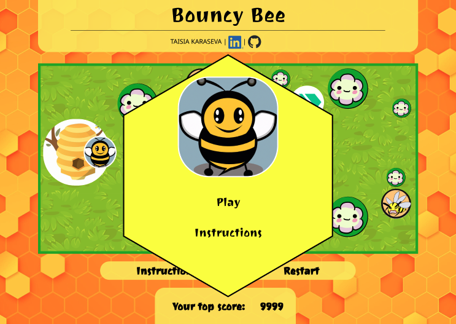
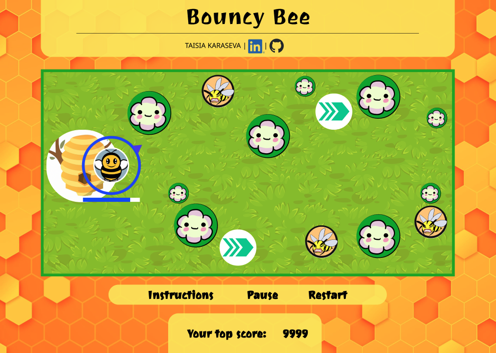
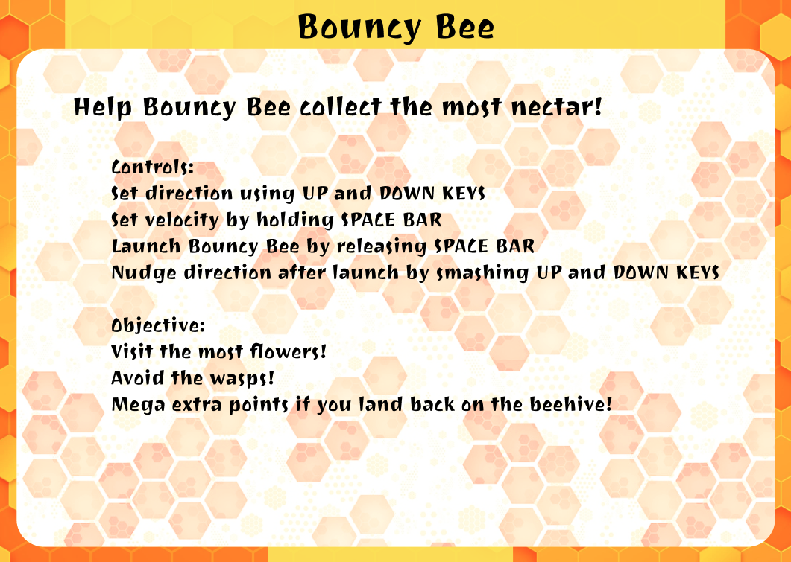
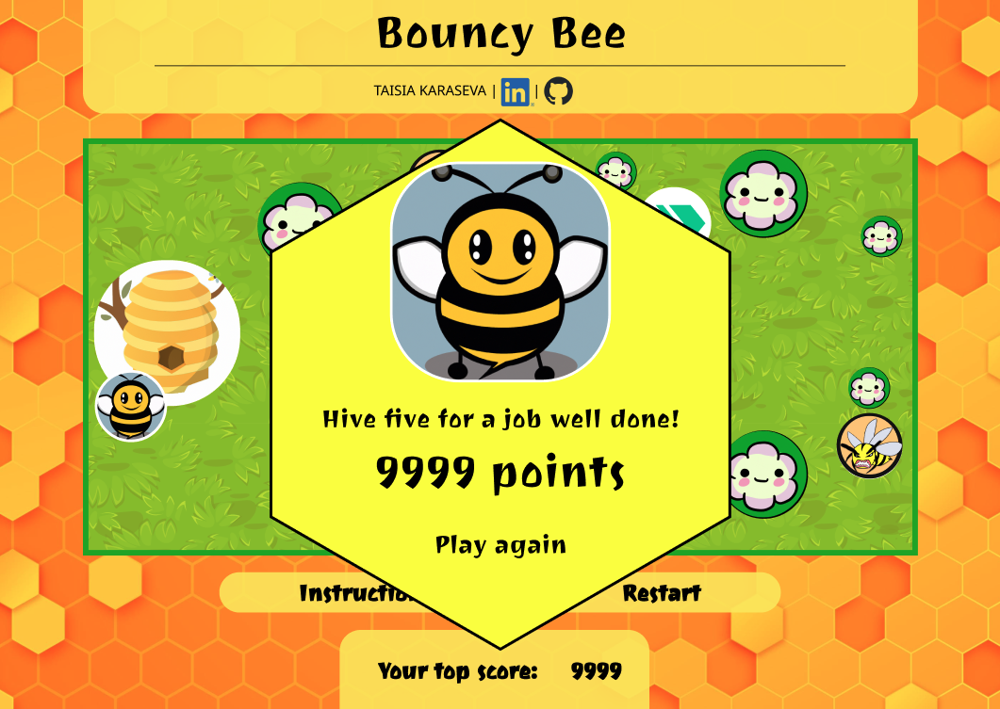
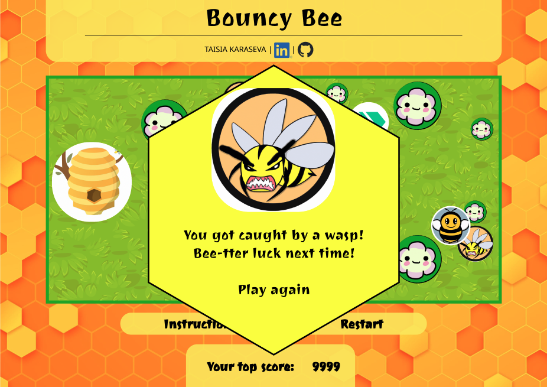
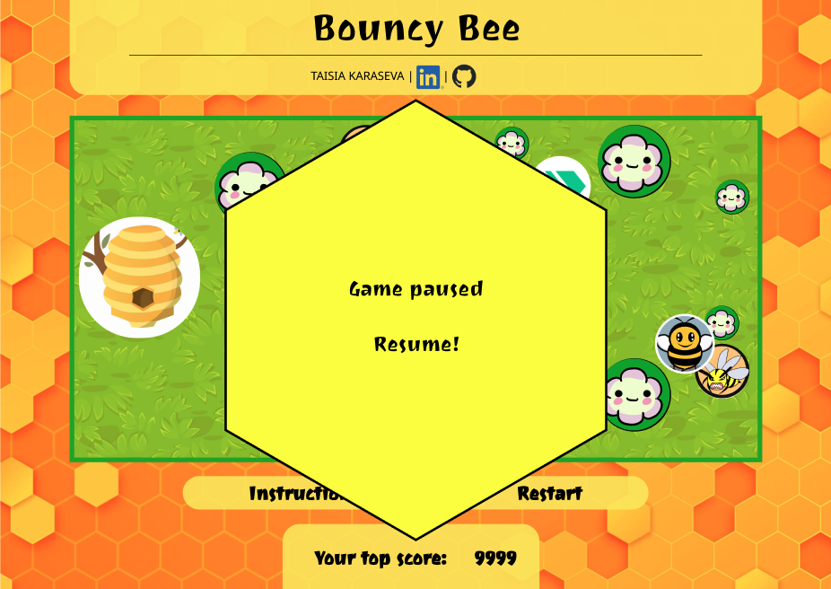

# bouncy-bee

_Javascript game akin to shuffleboard, pool, and cannon shooter_

### Background

BouncyBee is a game where the player sets the trajectory and velocity of a bee from a static starting point at the beehive (similar to cannon shooter games), and the bee then flies through a gameboard of obstacles. It bounces off edges and aims to touch certain areas (flowers) and avoid others (wasps), similar to shuffleboard and pool. The player can marginally nudge trajectory while the bee is in flight. The bee's velocity falls over time until it stops (lands), at which point the game round ends and points tally.

The player earns points when the bee flies across (pollinates!) flowers, and gets extra points if the bee lands back at the beehive. The player loses if the bee runs into any wasps.

### Functionality & MVPs

In BouncyBee, users will be able to:

- Start, pause, and reset the game
- Set initial bee trajectory using up/down arrow keys
- Set initial bee velocity by holding/releasing spacebar; timing of the release impacts which velocity is applied
- Nudge the bee's trajectory by smashing the up/down arrow keys
- Play through several levels where locations of flowers and wasps change
- Keep track of high scores during the browser session

#### In addition, this project will include:

- An About modal describing the background and rules of the game
- A production README
- Links to GitHub and LinkedIn profile

### Wireframes

### Technologies, Libraries, APIs

This project will be implemented with the following technologies:

- The `Canvas API` to render the game board
- `Webpack` and `Babel` to bundle and transpile the source JavaScript code
- `npm` to manage project dependencies
- `SCSS` and `HTML` to generate the webpage around the game play area

### Implementation Timeline

- Thursday:
  - Create wireframes
  - Set up project file structure and get webpack running
- Friday Afternoon & Weekend:
  - Create `Bee`, `Beehive`, `Flower`, `SpeedStrip`, and `Predator` classes
  - Render canvas to the webpage with initial board setup
  - Add minimally-styled wireframe elements to the webpage
  - Write logic for user interaction, ie arrow and spacebar to set bee trajectory and velocity and nudge trajectory after bee release
  - Write logic for bee bounce from edge of canvas and deceleration/acceleration physics
  - Write logic for bee 'collisions' with flowers, beehive, and wasps
- Monday:
  - Write logic for game over, points totalling, and showing highscore
  - Create functionality for starting/win/lose screen and game start/pause/reset
  - Create content and functionality for having several game levels
- Tuesday:
  - Write player-facing instructions and webpage content
  - Reskin the game with background and character graphics
  - Improve styling on HTML elements
- Wednesday:
  - Add visual effects for bee release, bounce, flower pollination, hive land, and enemy capture
  - Write production README
- Thursday Morning:
  - Squash minor bugs
  - Deploy project to GitHub pages

### Bonus Features

This game's fun can be increased with these anticipated enhancements:

- Enable predators to move
- Add additional areas of altered physics, such as worm holes
- Change points awarded based on proximity of bee to center of the hive or flower
- Add additional levels
- Refactor to use a physics engine, enabling non-circle shapes

### Asset Attribution

- Background image by <a href="https://www.freepik.com/free-vector/gradient-hexagonal-background_13900570.htm#query=honeycomb&position=6&from_view=keyword&track=sph">Freepik</a>

- <a href="https://www.freepik.com/free-vector/seamless-textured-grass-natural-grass-pattern_11930799.htm#query=grass%20field%20from%20above&position=7&from_view=search&track=ais">Background image by babysofja</a> on Freepik

- Background image by <a href="https://pixabay.com/users/chenspec-7784448/?utm_source=link-attribution&amp;utm_medium=referral&amp;utm_campaign=image&amp;utm_content=5270962">Chen</a> from <a href="https://pixabay.com//?utm_source=link-attribution&amp;utm_medium=referral&amp;utm_campaign=image&amp;utm_content=5270962">Pixabay</a>

- <a href="https://www.freepik.com/free-vector/directional-arrow-sign-icons-set-design_9727765.htm#query=right%20arrows&position=0&from_view=search&track=ais">SpeedStrip image by starline</a> on Freepik

- Character graphics by <a href="https://openai.com/product/dall-e-2">DALL-E</a>

- Witty content by <a href="https://chat.openai.com/chat">ChatGPT</a>
